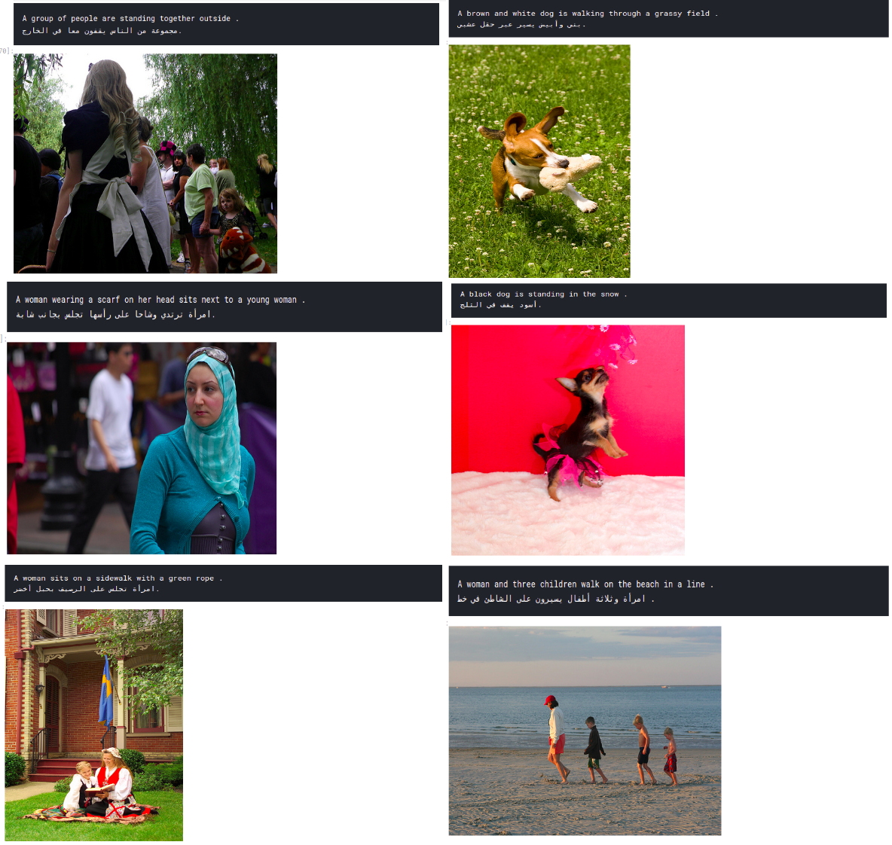

# Image-Captioning using InceptionV3 and Beam Search

Using Flickr8k dataset since the size is 1GB. MS-COCO is 14GB!

this project was inspired from  [here](https://github.com/yashk2810/Image-Captioning)
building the same modal again from scratch just for learning and we added arabic translation using azure services

# Dependencies

* Keras 1.2.2
* Tensorflow 1.14
* tqdm
* numpy
* pandas
* matplotlib
* pickle
* PIL
* glob

# References

[1] M. Hodosh, P. Young and J. Hockenmaier (2013) "Framing Image Description as a Ranking Task: Data, Models and Evaluation Metrics", Journal of Artificial Intelligence Research, Volume 47, pages 853-899 <a href="http://www.jair.org/papers/paper3994.html">http://www.jair.org/papers/paper3994.html</a> 

[2] Oriol Vinyals, Alexander Toshev, Samy Bengio, Dumitru Erhan <a href="https://arxiv.org/abs/1411.4555">Show and Tell: A Neural Image Caption Generator</a>

[3] CS231n Winter 2016 Lesson 10 Recurrent Neural Networks, Image Captioning and LSTM <a href="https://youtu.be/cO0a0QYmFm8?t=32m25s">https://youtu.be/cO0a0QYmFm8?t=32m25s</a> 
